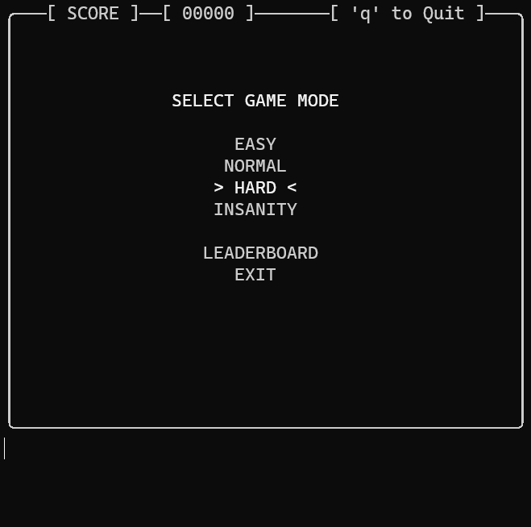

Table of Contents 
- [Live!](#live)
- [Demo](#demo)
- [Installation](#installation)
- [How to run](#how-to-run)
- [Architecture](#architecture)
- [Roadmap](#roadmap)
- [Contributing](#contributing)
- [Contact](#contact)
- [Donations](#donations)

## Live!
Currently running on `turutupa.com`. You may play gsnake using 
```bash
$ ssh <your_username>@turutupa.com -p 5555
```

## Demo 
<div align="center">
  
</div>

## Installation
Execute `install.sh` script

```bash
$ ./install.sh
```

## How to run
### Running locally
Upon installation you can start playing locally by running 
```bash 
$ gsnake 
```

### Hosting SSH server
If you want to self-host a gsnake SSH server you can run it by using the `-m` and `-p` flags which stand for `mode` and `port`. Port number defaults to `5555` if not specified.

```bash
$ gsnake -m ssh -p <port_number>
```

## Architecture 
To be updated.


## Roadmap
- [ ] Update README with latest changes
    - [ ] Update architecture with SSH details
- [x] ~~Add bash script to install/run the game~~
- [x] ~~Finish README.md including how to install on machine~~
- [ ] Inifite mode? Where you can only die if snake hits itself
- [ ] Refactor game so that grid is double columned (this way width and height will be roughly the same)
- [ ] Improve leaderboard 
    - [x] ~~Add some borders~~
    - [ ] Add the option to input username
    - [ ] See top scores by difficulty/mode
- [x] ~~Add main menu~~
    - [x] ~~Be able to select difficulty~~
- [ ] Super fruit! Add a super fruit (maybe every 5 fruit pieces?) that will appear for an X amount of time
    1. If you eat it in that time snake will not get longer, 
    2. otherwise it simply disappears
- [x] ~~Completely new project would involve to convert this to a SSH application~~
- [ ] Versus mode! Let players fight!
    - [ ] Create rooms/lobbies
    - [ ] Create new game logic for multiplayer. This could also work for local mode (1 keyboard)
    - [ ] Power ups? // not in the near future

## Contributing
Contributions are what make the open source community such an amazing place to learn, inspire, and create. Any contributions you make are greatly appreciated.

If you have a suggestion that would make this better, please fork the repo and create a pull request. You can also simply open an issue with the tag "enhancement". Don't forget to give the project a star! Thanks again!

1. Fork the Project
2. Create your Feature Branch (git checkout -b feature/AmazingFeature)
3. Commit your Changes (git commit -m 'Add some AmazingFeature')
4. Push to the Branch (git push origin feature/AmazingFeature)
5. Open a Pull Request

## Contact
Feel free to send me an email to albertodelgadocabrera@gmail.com or schedule a call at [cal.com/alber](https://cal.com/alber).

## Donations
I'm trying to run a server with the game running so donations would help greatly into paying it. Additionally, it may get laggy for users connecting from far away so I'd love to be able to have servers running on different zones.

<div align="center">
    <a href="https://www.buymeacoffee.com/turutupa" target="_blank"></a>
</div> 
