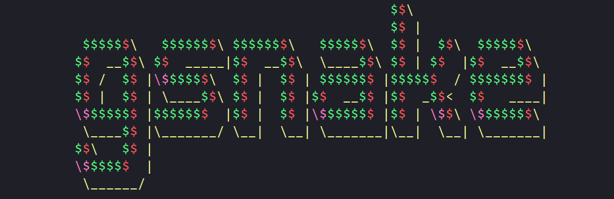
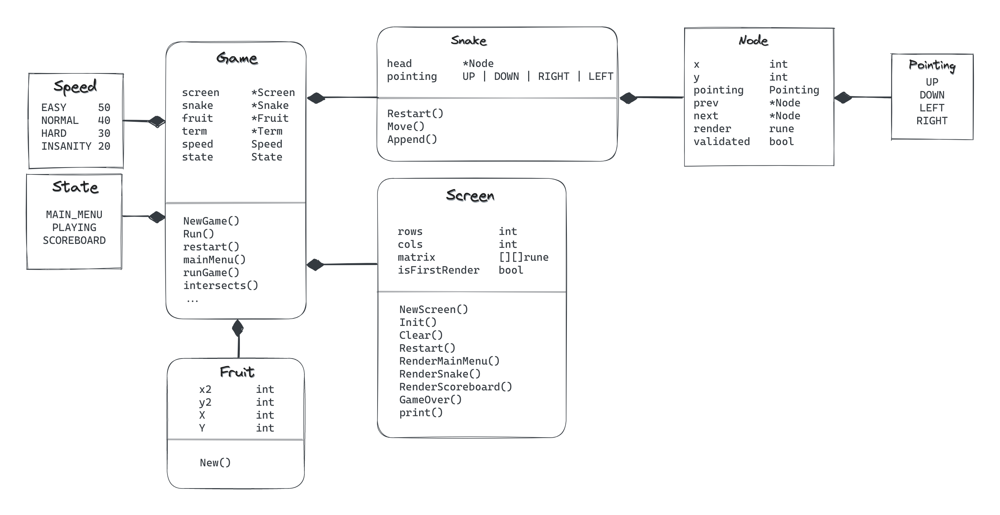

<div align="right">
    <a href="https://www.buymeacoffee.com/turutupa" target="_blank"></a>
</div> 



## Install && Run 
Execute `install.sh` script 

```bash
$ ./install.sh
```

After you've installed you can run
```bash 
$ gsnake 
```

## Architecture 
Representative schematic, doesn't reflect 100% the code but the main components.



## Motivation
The purpose of this project is merely educational and fun. Originally my objective was to create an SSH app out of it - still hoping to build it - but most importantly, learn. That is why no external libraries were used, like `tcell`, in order to capture user input or rendering the graphics. Everything is done natively in go.

## Contribute
I'm more than happyp if you want to help out by either bringing new cool ideas or by implementing some of the pending features (see more in the TO DO list down below).

Feel free to post new issues or we can even schedule a call.

## TO DO
- ~~Add bash script to install/run the game~~
- ~~Finish README.md including how to install on machine~~
- Improve leaderboard 
    - ~~Add some borders~~
    - Add the option to input username
    - See top scores by (difficulty) mode
- ~~Add main menu~~
    - ~~Be able to select difficulty~~
- Super fruit! Add a super fruit (maybe every 5 fruit pieces?) that will appear for an X amount of time
    - If you eat it in that time snake will not get longer, 
    - otherwise it simply disappears
- Completely new project would involve to conver this to a SSH application 
